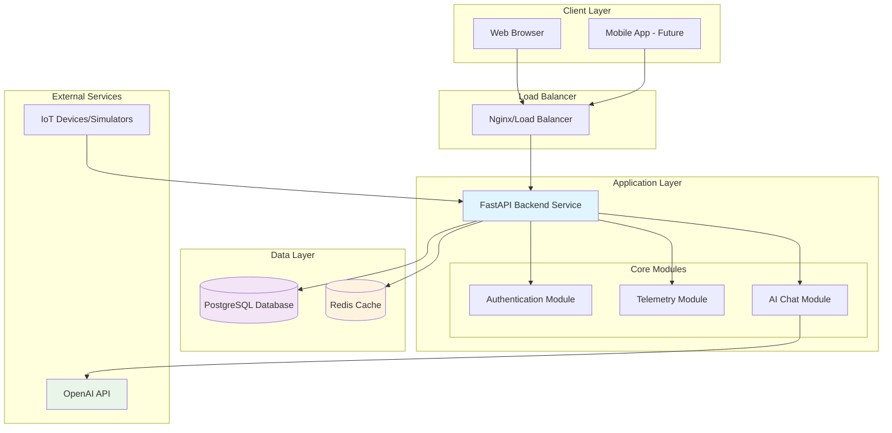
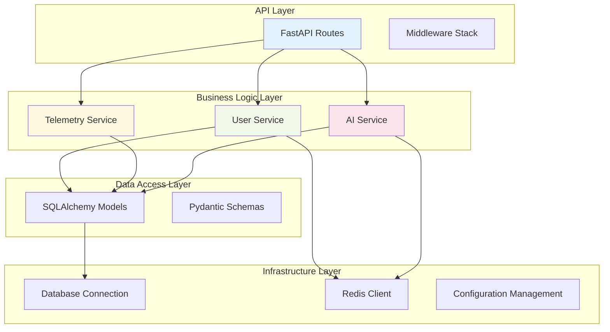
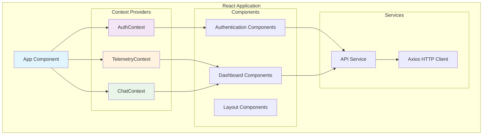
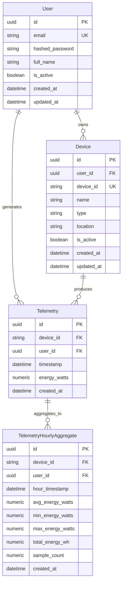
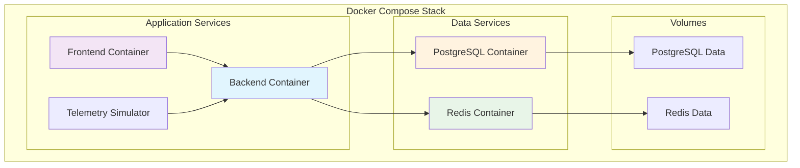

# Smart Home Energy Monitoring System - System Design Document

## Table of Contents
1. [System Overview](#system-overview)
2. [Architecture Overview](#architecture-overview)
3. [Backend Architecture](#backend-architecture)
4. [Frontend Architecture](#frontend-architecture)
5. [Data Models](#data-models)
6. [API Design](#api-design)
7. [Infrastructure & Deployment](#infrastructure--deployment)
8. [Security Architecture](#security-architecture)
9. [Performance & Scalability](#performance--scalability)
10. [Key Design Decisions](#key-design-decisions)
11. [Technology Stack](#technology-stack)
12. [Future Considerations](#future-considerations)

## System Overview

The Smart Home Energy Monitoring System is a comprehensive IoT solution designed to track, analyze, and optimize energy consumption across smart home devices. The system provides real-time monitoring, historical analytics, and AI-powered insights to help users understand and reduce their energy usage.

### Core Features
- **Real-time Energy Monitoring**: Live tracking of device power consumption
- **Historical Analytics**: Trend analysis and consumption patterns
- **AI-Powered Insights**: Natural language queries and energy optimization recommendations
- **Device Management**: Registration and monitoring of smart home devices
- **User Authentication**: Secure multi-user access with role-based permissions
- **Data Visualization**: Interactive dashboards and charts

## Architecture Overview

The system follows a modern microservices-inspired architecture with a unified backend service, React frontend, and supporting infrastructure components.



## Backend Architecture

### Unified Service Architecture

The backend is implemented as a unified FastAPI service that consolidates three main functional areas:

#### 1. Authentication Module (`/api/v1/auth`)
- User registration and login
- JWT token management
- Password reset functionality
- User profile management
- Role-based access control

#### 2. Telemetry Module (`/api/v1/telemetry`)
- Device registration and management
- Real-time telemetry data ingestion
- Batch data processing
- Historical data aggregation
- Energy consumption analytics

#### 3. AI Chat Module (`/api/v1/chat`)
- Natural language query processing
- Conversation history management
- Energy insights generation
- Suggested questions
- Integration with OpenAI GPT models

### Service Layer Architecture



### Key Backend Components

#### Configuration Management
- **Pydantic Settings**: Type-safe configuration with environment variable support
- **Environment-based Configuration**: Separate configs for development, staging, production
- **Secret Management**: Secure handling of API keys and database credentials

#### Database Layer
- **PostgreSQL**: Primary data store with ACID compliance
- **SQLAlchemy ORM**: Object-relational mapping with async support
- **Alembic Migrations**: Database schema versioning and migration management
- **Connection Pooling**: Optimized database connection management

#### Caching Layer
- **Redis**: High-performance caching for session data and frequently accessed information
- **Conversation Caching**: AI chat history and context preservation
- **Query Result Caching**: Performance optimization for analytics queries

#### Security Implementation
- **JWT Authentication**: Stateless token-based authentication
- **Password Hashing**: bcrypt with configurable rounds
- **CORS Configuration**: Cross-origin request handling
- **Rate Limiting**: API endpoint protection against abuse
- **Input Validation**: Pydantic schema validation for all inputs

## Frontend Architecture

### React Application Structure

The frontend is built as a Single Page Application (SPA) using React with TypeScript, following modern React patterns and best practices.



### Frontend Architecture Patterns

#### Context-Based State Management
- **AuthContext**: User authentication state and methods
- **TelemetryContext**: Device data and energy metrics
- **ChatContext**: AI conversation state and history

#### Component Architecture
- **Atomic Design**: Reusable component hierarchy
- **Container/Presentational Pattern**: Separation of logic and presentation
- **Custom Hooks**: Reusable stateful logic

#### Routing & Navigation
- **React Router**: Client-side routing with protected routes
- **Route Guards**: Authentication-based access control
- **Lazy Loading**: Code splitting for performance optimization

## Data Models

### Core Entity Relationships



### Data Model Design Decisions

#### User Model
- **UUID Primary Keys**: Globally unique identifiers for security
- **Email-based Authentication**: Standard email/password login
- **Soft Delete Pattern**: `is_active` flag for user deactivation
- **Audit Fields**: Creation and update timestamps

#### Device Model
- **Flexible Device Identification**: Support for various device ID formats
- **Hierarchical Organization**: Type and location categorization
- **User Isolation**: All devices belong to specific users
- **Metadata Storage**: Name, type, and location for better UX

#### Telemetry Model
- **High-Frequency Data**: Optimized for frequent inserts
- **Time-Series Design**: Timestamp-based indexing
- **Precision Storage**: Numeric type for accurate power measurements
- **User Context**: Direct user association for data isolation

#### Aggregation Model
- **Performance Optimization**: Pre-computed hourly statistics
- **Statistical Metrics**: Min, max, average, and total calculations
- **Sample Tracking**: Count of original data points
- **Time-Based Partitioning**: Hourly buckets for efficient queries

## API Design

### RESTful API Structure

The API follows REST principles with consistent naming conventions and HTTP methods.

#### Authentication Endpoints
```
POST   /api/v1/auth/register          # User registration
POST   /api/v1/auth/login             # User login
GET    /api/v1/auth/me                # Get current user
PUT    /api/v1/auth/me                # Update user profile
POST   /api/v1/auth/change-password   # Change password
POST   /api/v1/auth/logout            # User logout
```

#### Telemetry Endpoints
```
POST   /api/v1/telemetry              # Submit telemetry data
POST   /api/v1/telemetry/batch        # Batch telemetry submission
GET    /api/v1/telemetry              # Get telemetry data
GET    /api/v1/telemetry/stats/{device_id}  # Device statistics
GET    /api/v1/telemetry/summary      # Energy consumption summary
GET    /api/v1/telemetry/realtime     # Real-time metrics
GET    /api/v1/telemetry/devices      # User devices
```

#### AI Chat Endpoints
```
POST   /api/v1/chat/query             # Send chat message
GET    /api/v1/chat/history           # Get conversation history
DELETE /api/v1/chat/history           # Clear conversation
GET    /api/v1/chat/suggestions       # Get suggested questions
```

### API Design Principles

#### Request/Response Format
- **JSON-based Communication**: All requests and responses use JSON
- **Consistent Error Format**: Standardized error response structure
- **Pagination Support**: Cursor-based pagination for large datasets
- **Field Selection**: Optional field filtering for bandwidth optimization

#### Authentication & Authorization
- **Bearer Token Authentication**: JWT tokens in Authorization header
- **User Context**: All operations scoped to authenticated user
- **Permission Validation**: Role-based access control where applicable

#### Data Validation
- **Pydantic Schemas**: Type-safe request/response validation
- **Input Sanitization**: Protection against injection attacks
- **Business Rule Validation**: Domain-specific validation logic

## Infrastructure & Deployment

### Containerized Deployment

The system uses Docker containers for consistent deployment across environments.



### Container Configuration

#### Backend Container
- **Base Image**: Python 3.11 Alpine
- **Package Management**: Poetry for dependency management
- **Health Checks**: Built-in health check endpoints
- **Environment Configuration**: Environment variable injection
- **Volume Mounts**: Code and migration directories

#### Database Container
- **PostgreSQL 15**: Latest stable version with Alpine base
- **Data Persistence**: Named volume for data storage
- **Health Checks**: pg_isready for container health
- **Initialization**: Automatic database creation

#### Redis Container
- **Redis 7**: Latest stable version with Alpine base
- **Data Persistence**: Named volume for cache storage
- **Health Checks**: Redis ping for container health
- **Configuration**: Memory optimization settings

### Deployment Strategy

#### Development Environment
- **Docker Compose**: Local development stack
- **Hot Reload**: Code changes reflected immediately
- **Debug Mode**: Enhanced logging and error reporting
- **Test Data**: Automated telemetry simulation

#### Production Considerations
- **Container Orchestration**: Kubernetes or Docker Swarm
- **Load Balancing**: Nginx or cloud load balancer
- **SSL/TLS**: HTTPS encryption for all communications
- **Monitoring**: Application and infrastructure monitoring
- **Backup Strategy**: Database and configuration backups

## Security Architecture

### Authentication & Authorization

#### JWT Token Management
- **Token Structure**: Header, payload, and signature components
- **Expiration Policy**: 24-hour token lifetime with refresh capability
- **Secure Storage**: HttpOnly cookies for web clients
- **Token Validation**: Signature verification and expiration checks

#### Password Security
- **Hashing Algorithm**: bcrypt with configurable rounds (default: 12)
- **Salt Generation**: Unique salt per password
- **Password Policy**: Minimum length and complexity requirements
- **Reset Mechanism**: Secure password reset via email tokens

### Data Protection

#### Database Security
- **Connection Encryption**: SSL/TLS for database connections
- **User Isolation**: Row-level security for multi-tenant data
- **Backup Encryption**: Encrypted database backups
- **Access Control**: Principle of least privilege for database users

#### API Security
- **Input Validation**: Comprehensive input sanitization
- **Rate Limiting**: Protection against brute force attacks
- **CORS Policy**: Restricted cross-origin access
- **Security Headers**: HSTS, CSP, and other security headers

### Infrastructure Security

#### Container Security
- **Base Image Security**: Regular security updates
- **Non-root Execution**: Containers run as non-privileged users
- **Secret Management**: Environment variable injection
- **Network Isolation**: Container network segmentation

#### Network Security
- **Internal Communication**: Service-to-service encryption
- **Firewall Rules**: Restricted port access
- **VPN Access**: Secure administrative access
- **Monitoring**: Security event logging and alerting

## Performance & Scalability

### Database Optimization

#### Indexing Strategy
- **Primary Indexes**: UUID primary keys with B-tree indexes
- **Composite Indexes**: Multi-column indexes for common queries
- **Time-Series Indexes**: Optimized for timestamp-based queries
- **Partial Indexes**: Filtered indexes for active records

#### Query Optimization
- **Connection Pooling**: Efficient database connection management
- **Query Caching**: Redis caching for frequently accessed data
- **Batch Operations**: Bulk insert/update operations
- **Pagination**: Cursor-based pagination for large result sets

### Application Performance

#### Caching Strategy
- **Redis Caching**: Session data and query result caching
- **Application-Level Caching**: In-memory caching for static data
- **CDN Integration**: Static asset delivery optimization
- **Cache Invalidation**: Smart cache invalidation strategies

#### Asynchronous Processing
- **Async/Await**: Non-blocking I/O operations
- **Background Tasks**: Celery for long-running operations
- **Message Queues**: Redis-based task queuing
- **Batch Processing**: Aggregation and analytics processing

### Scalability Considerations

#### Horizontal Scaling
- **Stateless Design**: Session data stored in Redis
- **Load Balancing**: Multiple backend instances
- **Database Sharding**: User-based data partitioning
- **Microservices Migration**: Future service decomposition

#### Vertical Scaling
- **Resource Optimization**: CPU and memory tuning
- **Database Tuning**: PostgreSQL configuration optimization
- **Connection Limits**: Appropriate connection pool sizing
- **Monitoring**: Performance metrics and alerting

## Key Design Decisions

### 1. Unified Backend Service

**Decision**: Implement a single FastAPI service instead of separate microservices.

**Rationale**:
- **Simplified Development**: Easier to develop, test, and deploy
- **Reduced Complexity**: Fewer moving parts and network calls
- **Shared Resources**: Common database connections and caching
- **Faster Development**: Rapid prototyping and feature development

**Trade-offs**:
- **Scaling Limitations**: All components scale together
- **Technology Lock-in**: Single technology stack for all features
- **Deployment Coupling**: Changes require full service deployment

### 2. PostgreSQL as Primary Database

**Decision**: Use PostgreSQL for all persistent data storage.

**Rationale**:
- **ACID Compliance**: Strong consistency guarantees
- **JSON Support**: Flexible schema for device metadata
- **Time-Series Capabilities**: Efficient timestamp-based queries
- **Mature Ecosystem**: Extensive tooling and community support

**Trade-offs**:
- **Scaling Complexity**: Vertical scaling limitations
- **Cost**: Higher resource requirements than NoSQL alternatives
- **Schema Rigidity**: More complex schema changes

### 3. Redis for Caching and Sessions

**Decision**: Use Redis for caching, session storage, and real-time data.

**Rationale**:
- **High Performance**: In-memory data structure store
- **Persistence Options**: Configurable durability guarantees
- **Data Structures**: Rich data types for complex caching scenarios
- **Pub/Sub Support**: Real-time messaging capabilities

**Trade-offs**:
- **Memory Usage**: Higher memory requirements
- **Complexity**: Additional infrastructure component
- **Data Loss Risk**: Potential data loss on failures

### 4. JWT for Authentication

**Decision**: Implement JWT-based stateless authentication.

**Rationale**:
- **Stateless Design**: No server-side session storage required
- **Scalability**: Easy to scale across multiple instances
- **Standard Compliance**: Industry-standard authentication method
- **Mobile Friendly**: Suitable for future mobile applications

**Trade-offs**:
- **Token Size**: Larger than session IDs
- **Revocation Complexity**: Difficult to revoke tokens immediately
- **Security Considerations**: Token exposure risks

### 5. React with Context API

**Decision**: Use React with Context API for state management.

**Rationale**:
- **Built-in Solution**: No additional dependencies required
- **Simplicity**: Easier to understand and maintain
- **Performance**: Adequate for current application size
- **Flexibility**: Easy to migrate to Redux if needed

**Trade-offs**:
- **Re-render Issues**: Potential unnecessary re-renders
- **Debugging**: Less sophisticated debugging tools
- **Complexity Growth**: May become unwieldy as app grows

### 6. Material-UI Component Library

**Decision**: Use Material-UI (MUI) for UI components.

**Rationale**:
- **Comprehensive**: Complete component library
- **Design System**: Consistent design language
- **Accessibility**: Built-in accessibility features
- **Customization**: Extensive theming capabilities

**Trade-offs**:
- **Bundle Size**: Larger JavaScript bundle
- **Learning Curve**: Framework-specific patterns
- **Design Constraints**: Limited design flexibility

## Technology Stack

### Backend Technologies
- **Framework**: FastAPI 0.104.1
- **Language**: Python 3.11
- **Database**: PostgreSQL 15
- **ORM**: SQLAlchemy 2.0 (async)
- **Caching**: Redis 7
- **Authentication**: JWT with python-jose
- **Password Hashing**: bcrypt via passlib
- **Migrations**: Alembic
- **HTTP Client**: httpx
- **AI Integration**: OpenAI API, LangChain
- **Data Processing**: Pandas, NumPy

### Frontend Technologies
- **Framework**: React 18.2
- **Language**: TypeScript 4.7
- **UI Library**: Material-UI 5.14
- **Routing**: React Router 6.8
- **HTTP Client**: Axios 1.6
- **Charts**: Recharts 2.8, MUI X-Charts 6.0
- **Date Handling**: date-fns 2.30
- **Build Tool**: Create React App

### Infrastructure Technologies
- **Containerization**: Docker & Docker Compose
- **Web Server**: Uvicorn (ASGI)
- **Process Management**: Poetry (Python)
- **Package Management**: npm (Frontend)
- **Version Control**: Git
- **Database Migration**: Alembic

### Development Tools
- **Code Formatting**: Black, isort (Python), Prettier (TypeScript)
- **Linting**: flake8 (Python), ESLint (TypeScript)
- **Type Checking**: mypy (Python), TypeScript compiler
- **Testing**: pytest (Python), Jest (TypeScript)
- **API Documentation**: FastAPI automatic OpenAPI/Swagger

## Future Considerations

### Scalability Enhancements

#### Microservices Migration
- **Service Decomposition**: Split into auth, telemetry, and AI services
- **API Gateway**: Centralized routing and authentication
- **Service Discovery**: Dynamic service registration and discovery
- **Inter-Service Communication**: gRPC or message queues

#### Database Scaling
- **Read Replicas**: Separate read and write operations
- **Sharding Strategy**: User-based or time-based partitioning
- **Time-Series Database**: InfluxDB or TimescaleDB for telemetry data
- **Data Archiving**: Cold storage for historical data

### Feature Enhancements

#### Advanced Analytics
- **Machine Learning**: Predictive analytics and anomaly detection
- **Real-time Processing**: Stream processing with Apache Kafka
- **Advanced Visualizations**: Custom charting and reporting
- **Export Capabilities**: Data export in various formats

#### Mobile Application
- **React Native**: Cross-platform mobile development
- **Push Notifications**: Real-time alerts and notifications
- **Offline Support**: Local data caching and synchronization
- **Device Integration**: Direct IoT device communication

#### Integration Capabilities
- **Third-party APIs**: Integration with smart home platforms
- **Webhook Support**: Real-time data push to external systems
- **MQTT Support**: Direct IoT device communication
- **Cloud Services**: AWS IoT, Google Cloud IoT integration

### Operational Improvements

#### Monitoring & Observability
- **Application Monitoring**: Prometheus and Grafana
- **Log Aggregation**: ELK stack or similar
- **Distributed Tracing**: Jaeger or Zipkin
- **Error Tracking**: Sentry or similar service

#### Security Enhancements
- **OAuth2 Integration**: Social login providers
- **Multi-factor Authentication**: TOTP or SMS-based 2FA
- **API Rate Limiting**: Advanced rate limiting strategies
- **Security Scanning**: Automated vulnerability scanning

#### DevOps & CI/CD
- **Continuous Integration**: GitHub Actions or GitLab CI
- **Automated Testing**: Unit, integration, and e2e tests
- **Infrastructure as Code**: Terraform or CloudFormation
- **Blue-Green Deployment**: Zero-downtime deployments

---